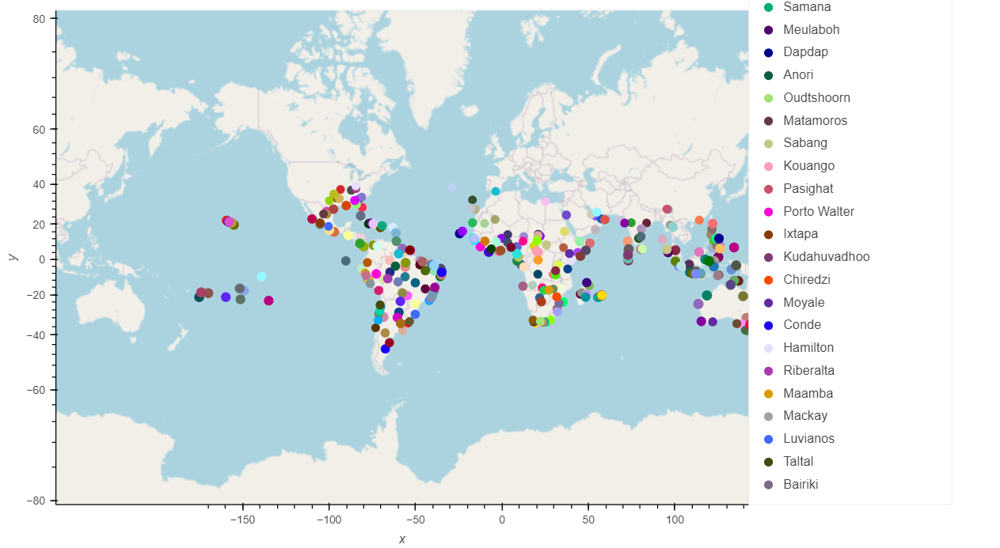
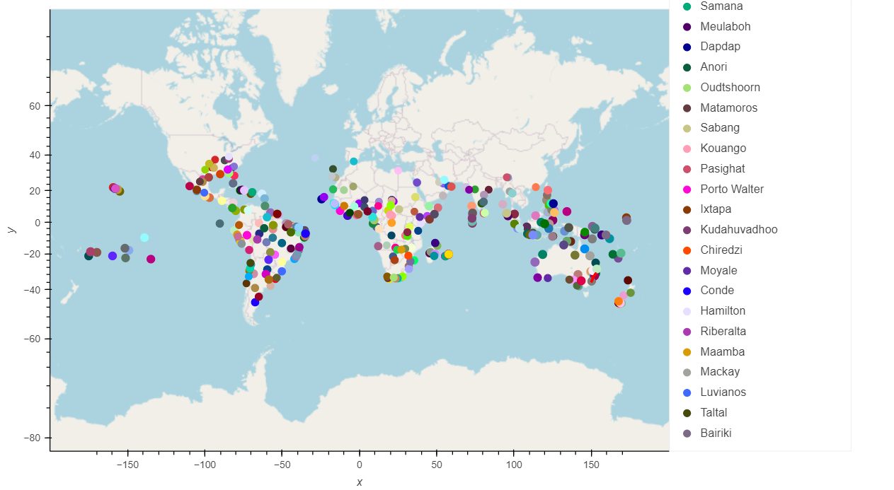

# World_Weather_Analysis
## Purpose

The purpose of this challenge was to improve the PlanMyTrip app so that it can also have descriptions of the weather in the weather data. Users will be able to filter through the data for their weather preference in different cities. This will narrow it down to different hotels nearby the city of their choice.

## Results

As a result, we have two maps. 
The first map has the information from the weather database and uses the GEOVIEW API to show different travel destinations with a hotel. In addition, you can also see the temperature, country, and weather condition listed.

The second map comes from the Vacation Itinerary folder. It uses directions to create a Vacation Itinerary. In this example, I used four cities located in Australia; Port Macquarie, Charlestown, Batemans Bay, and Ulladulla. This map also markers to show additional information on each city. A challenge that I ran into while doing this project was getting the map to zoom in and show the red line (directions) to each destination.

